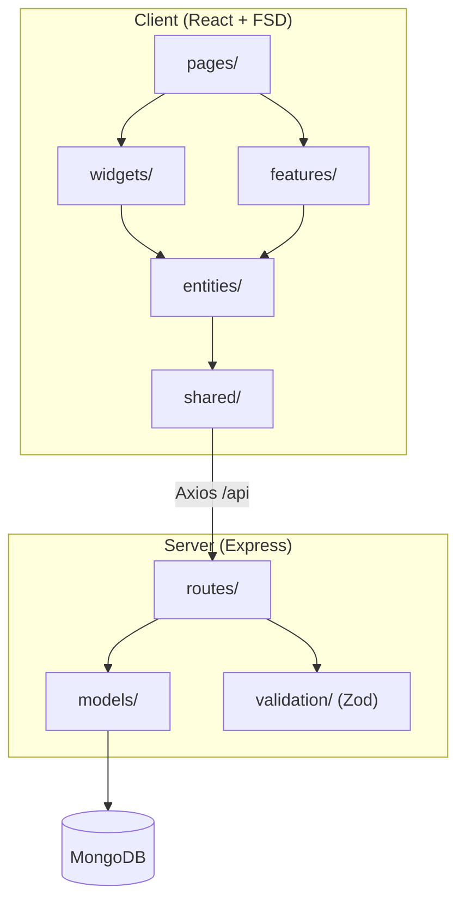
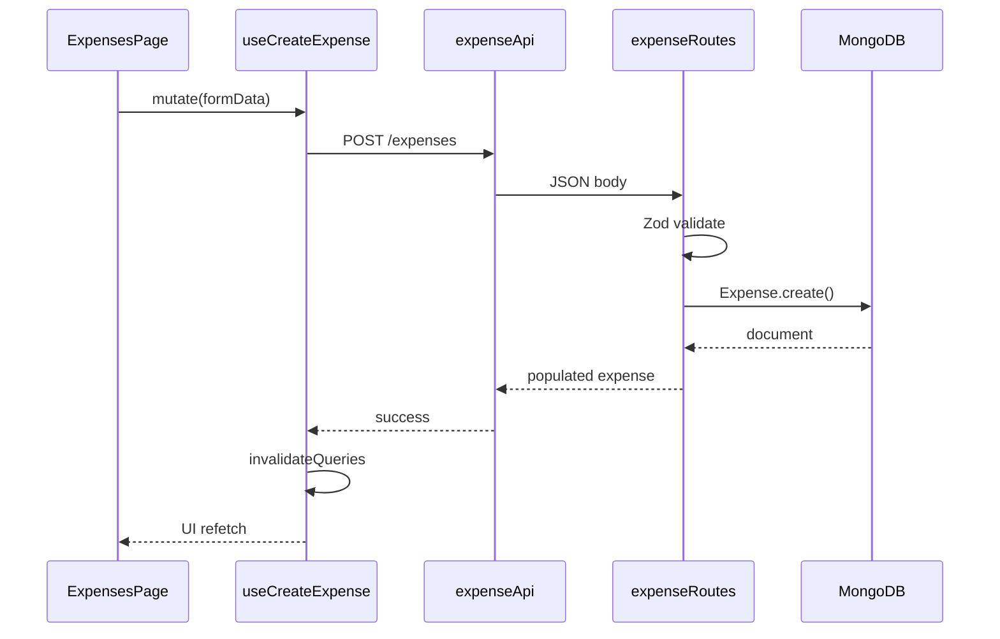
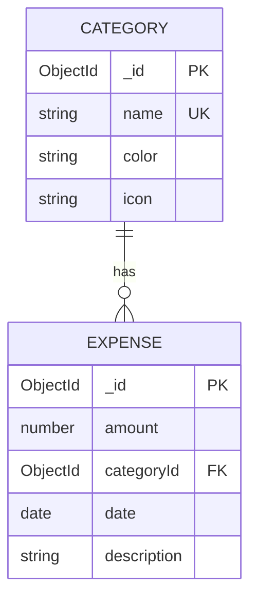

# Financial Manager — Architecture

## Overview

Монорепо для контролю місячних витрат. Frontend — **Feature-Sliced Design (FSD)** на React 19; backend — **Express 5 + Mongoose + MongoDB**. Клієнт спілкується з API через Axios; стан серверних даних — TanStack Query; обраний місяць — Zustand.

## Architecture Diagram



## Data Flow (CRUD Expense)



## ER Diagram



## API

| Method | Endpoint | Description |
|--------|----------|-------------|
| GET | `/api/categories` | Список категорій |
| GET | `/api/expenses?month=YYYY-MM` | Витрати за місяць |
| POST | `/api/expenses` | Створити витрату |
| PUT | `/api/expenses/:id` | Оновити витрату |
| DELETE | `/api/expenses/:id` | Видалити витрату |
| GET | `/api/analytics/by-category?month=` | Агрегація по категоріях |
| GET | `/api/analytics/monthly-total?month=` | Загальна сума за місяць |

## Key Design Decisions

- **Zod** на backend для валідації тіла запиту та формату місяця.
- **TanStack Query** з інвалідацією `expenses` + `analytics` після мутацій.
- **Zustand** лише для глобального фільтра місяця (мінімальний клієнтський стан).
- **Recharts PieChart** з кольорами з колекції `categories`.
- **Українська локалізація** через `Intl` (`uk-UA`, UAH).

## Seed Categories

```bash
npm run seed -w server
```

Дефолтні категорії: Їжа, Транспорт, Розваги, Комунальні, Інше.
